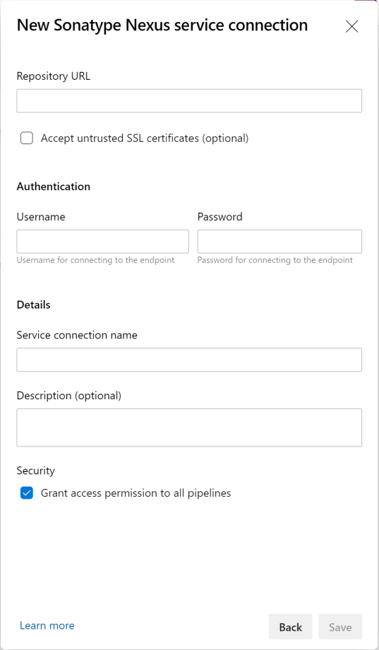
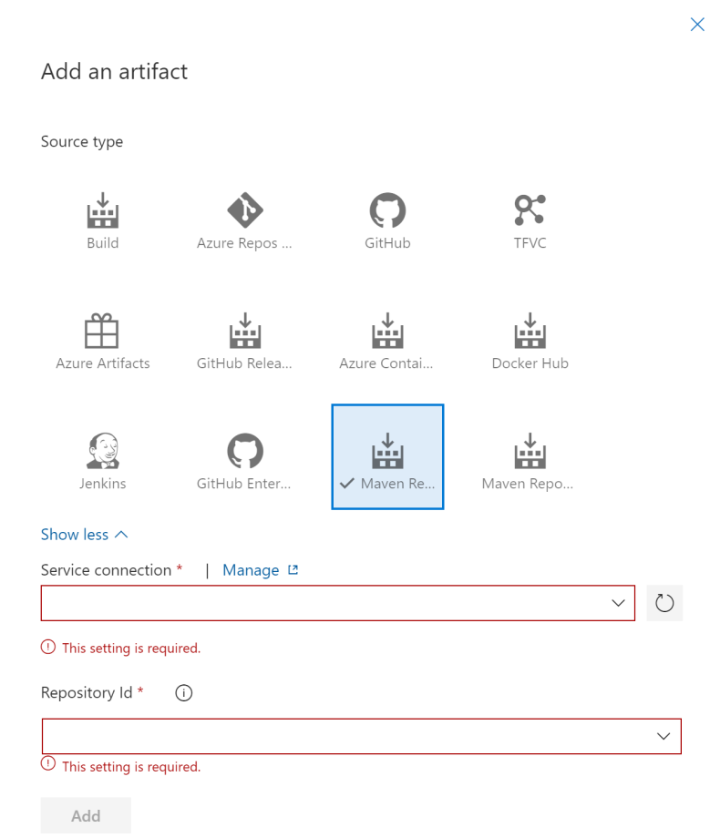
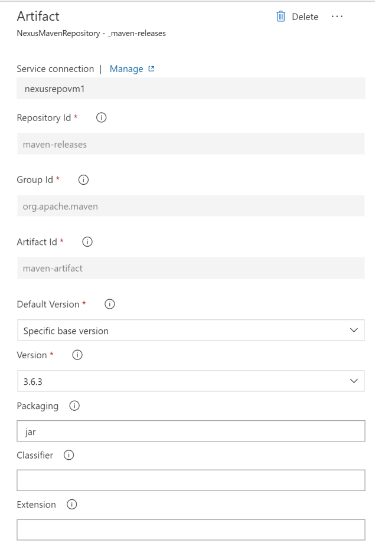

# Sonatype Nexus artifact for Release Pipelines
This extension provides support for Nexus Repository Manager (Maven Repositories) when leveraging Release Pipelines, the initial version includes Release Pipeline Artifact support for NXRM v3 Maven Repositories as well as providing Azure Pipelines tasks for downloading assets from both V2 & V3 Maven Repositories.

## Usage
This extension requires you to first configure a service connection to connect to your Nexus Repository Manager server. Once connected, you can link a source artifact from the a Nexus Repository Manager server v3 Maven Repository and use these artifacts in your Release Pipeline.

### Connecting to Nexus Repository Manager
Go to project settings -> Services Connections tab and create a New Service Connection of type Sonatype Nexus.

The authentication scenarios which are currently supported by the extension are :
* Username & Password

If your Nexus Repository Manager server is deployed on a private cloud behind a firewall and the Azure DevOps Service does not have line of sight to the server.

### Linking a NXRM v3 Maven Repository artifact
Once you have set up the service connection, you will be able to link to a Nexus Repository Manager v3 Maven Repository artifact in your release definition.

Once you have selected the Service Connection, you will be able to select the relevant repository from the pre-populated repository drop-down. You will also be asked to select the repository, and specify the Nexus components details.

## TODO
The following functionality is pending.

* Add support for NXRM v2 (Maven Repository) as a Release Artifact
